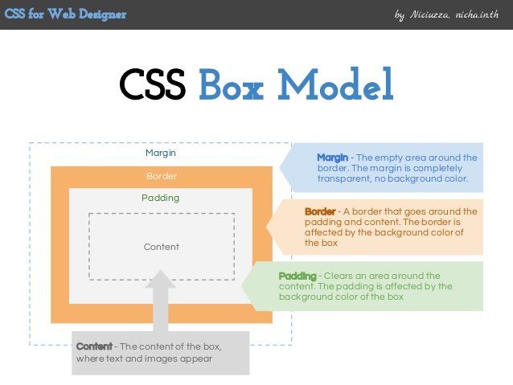
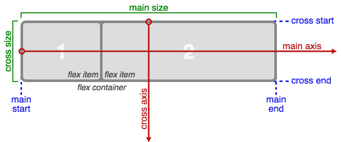

# CSS desde cero

CASCADE
STYLE
SHEET

==Hoja de Estilo en Cascada: Se irá leyendo de arriba a abajo. La última propiedad siempre gana==

## Agregando CSS al HTML

En línea:

```html
<elemento style= “estilos”>
    Texto
</elemento>

<style>
    Estilos
</style>

```

## Sintaxis

```css

/*Bloque*/

selector {
    propiedad-1 :  valor ;
    propiedad-2: valor ;
}

```

## Selectores

Selector de:

- Etiqueta (tipo) (HTML)
- Clases
- ID
- Universal ( * ), root (html)
- Descendiente (padre [espacio] hijo { … } )
- De atributo

_[http://apps.workflower.fi/vocabs/css/en](http://apps.workflower.fi/vocabs/css/en)_

## Variables CSS

Es un espacio de memoria donde almacena un valor.

```css

--nombre-variable : valor ;

```

```css

/* ejemplo */

--color-primary : red;
--ancho-maximo: 720px;
Utilizando la variable:
background-color: var( --color-primary );
```

## Estilo para textos

- `color`:  da color a la fuente
- `text-align`: alineación horizontal
- `text-decoration`: especifica la decoración agregada al texto
- `text-transform`: controla mayúsculas y minúsculas del texto
- `letter-spacing`: incrementa o decrementa el espacio entre letras
- `line-height`: espacio del interlineado
- `word-spacing`:  separación entre palabras
- `text-shadow`: sombreado al texto

## [Texto](https://www.w3schools.com/css/css_text.asp)

- Color: red | #ff22AC | rgb(255,100,0)  | hsl(240, 100%, 25%);
  - [https://www.w3schools.com/colors/colors_names.asp](https://www.w3schools.com/colors/colors_names.asp)
- Text-align : center | left | right | justify;
- Text-decoration : none | overline | line-through | underline ;
- Text-transform : uppercase | lowercase | capitalize;
- Letter-spacing : (+/ - ) px | em | rem;
- Word-spacing : (+/ - ) px | em | rem;
- Line-height :  px | em | rem | unidad;
- Overflow-wrap : normal | break-word ; ->
- white -space : nowrap | wrap | pre | normal;
  - [https://www.w3schools.com/cssref/pr_text_white-space.asp](https://www.w3schools.com/cssref/pr_text_white-space.asp)
- Text-overflow :  clip | ellipsis | initial | inherit ; ->

## Unidades de medida

### Absolutas

- Pulgadas (in)
- Centimetros (cm)
- Milimetros (mm)
- Pixels (px)
- Puntos (pt)

[https://developer.mozilla.org/en\-US/docs/Web/CSS/length](https://developer.mozilla.org/en-US/docs/Web/CSS/length)

### Relativas

- Contenedor (%)

Tipografía

- em (Contenedor)
- rem (Root \-> html \-> body)

Viewport

- Ancho ventana(vw)
- Alto ventana (vh)

[https://developer.mozilla.org/en\-US/docs/Learn/CSS/Introduction\_to\_CSS/Values\_and\_units](https://developer.mozilla.org/en-US/docs/Learn/CSS/Introduction_to_CSS/Values_and_units)

## [Fonts](https://developer.mozilla.org/en-US/docs/Learn/CSS/Styling_text/Fundamentals )

- Font-family : Define la fuente tipográfica que será aplicada al texto.
- Font-size : Define el tamaño de la fuente
- Font-style : Formato de la fuente
- Font-weight : Le da el peso a la fuente (que tan bold será)

Propiedades que pueden tener

- `font-family` : web fonts;
- `font-size` :  px | em | rem;
- `font-style` : normal | italic ;
- `font-weight` : normal | bold | lighter | bolder | 100-900;
- [@font\-face](https://developer.mozilla.org/en-US/docs/Web/CSS/@font-face)

Recursos:

[https://fonts.google.com](https://fonts.google.com)

## Estilos por defecto

El navegador contiene sus propios estilos por defecto en todos los elementos del HTML.


[Normalize](https://necolas.github.io/normalize.css/)

## Selectores

### Selector de Tipo

Selector de tipo (etiqueta HTML), NO los uses a menos que sea el estilo base o de tema.

```css

body{
    /* estilos aplicados a body */
}

h1 {
    /* estilos aplicados a todos los h1 */
}

p {
    /* estilos aplicados a todos los p */
}

```

### Selector de ID

> NO los uses.

```html
<!-- HTML File -->

<h1 id= “title”> Titulo del sitio </h1>

```

```css
/* Estilos aplicado a las etiqueta con el ID #title */
#title {
 color: red;
}

```

### Selector de Clase

Siempre debes usar clases para tus estilos.

```html
  <h1 class = “title”> Titulo del sitio </h1>
```

```css
.title {
   text-align: center;
}

```

## Especificidad (Specificity)

- Inline = 1000
- ID = 100
- Class = 10
- Type = 1
- `!important`: /_Nunca lo uses a menos que sea de vida o muerte_/ Su valor es infinito

[https://www.w3schools.com/css/css\_specificity.asp](https://www.w3schools.com/css/css_specificity.asp)

[https://developer.mozilla.org/en\-US/docs/Web/CSS/Specificity](https://developer.mozilla.org/en-US/docs/Web/CSS/Specificity)

### [Selectores compuestos](https://developer.mozilla.org/en-US/docs/Web/CSS/CSS_Selectors#Combinators)

Están formados por más de una palabra.

- Descendientes (_Espacio entre selectores_)

```css
ancestro descendientes {
  /* Estilos*/
}
```

Hijo directo ( > )

```css
padre > hijo {
  /* Estilos*/
}
```

Hermano siguiente (adyacente) (  _\+_ )

```css
elemento +  hermano-siguiente {
  /* Estilos*/
}
```

Hermanos siguientes   ( ~ ) (Todos los siguientes)

```css
elemento ~ hermanos-siguientes {
  /* Estilos*/
}
```

Selector compuesto (sin espacios) [tenga ambos selectores]

```css
selectorselector {
  /* Estilos*/
}
```

Selectores agrupados ( , ) [separados por comas]

```css
selector, selector, .,.. {
  /* Estilos*/
}
```

### Selectores de atributo

**Sintaxis:**

```css
selectorTipo[attribute] {
    /* Estilos */
}

a[href] {
  text-decoration: none;
}

```

- Comienza con (^)
  - `[title^=“palabra”] { … }`
- Termina con ($)
  - `[src$=".jpg"] { … }`
- Contiene ( * )
  - `[href*=".pdf"] { … }`
- Comienza especificamente con (|)
  - `[class|=“menu”] { … }`
- Contiene especificamente la palabra (~)
  - `[id~=“header”] { … }`
- Ignora mayúsculas y minúsculas (i o I )
  - `[src=“imagen” i ] { … }`

Mas información

- [https://developer.mozilla.org/en\-US/docs/Learn/CSS/Introduction\_to\_CSS/Attribute\_selectors](https://developer.mozilla.org/en-US/docs/Learn/CSS/Introduction_to_CSS/Attribute_selectors)
- [https://developer.mozilla.org/en\-US/docs/Web/CSS/Attribute\_selectors](https://developer.mozilla.org/en-US/docs/Web/CSS/Attribute_selectors)
- [https://www.w3schools.com/css/css\_attribute\_selectors.asp](https://www.w3schools.com/css/css_attribute_selectors.asp)

### Pseudo-clases ( `:` )

Son selectores dinámicos, responden a ciertas eventos que suceden con el elemento.

Sintaxis:

```css
selector : pseudo-class {

  /Estilos/

}

: pseudo-class { … } /*se aplica a todos los elementos*/

```

- [https://developer.mozilla.org/en\-US/docs/Learn/CSS/Introduction\_to\_CSS/Pseudo\-classes\_and\_pseudo\-elements](https://developer.mozilla.org/en-US/docs/Learn/CSS/Introduction_to_CSS/Pseudo-classes_and_pseudo-elements)
- [https://www.w3schools.com/css/css\_pseudo\_classes.asp](https://www.w3schools.com/css/css_pseudo_classes.asp)

### Tipos de Pseudo-clases

- `:hover`:  _Se activa al pasar el puntero sobre el elemento_
- `:active`:  _Cuando se da click sobre el elemento_
- `:link`:  _Link sin visitar aún_
- `:visited`:  _Cuando ya ha sido visitado el enlace_
- `:target`:  _Cuando mandan a llamar al elemento_
- `:not( *selector* )`: Selecciona los elementos que NO coinciden con el selector.
  - [https://www.w3schools.com/cssref/sel\_not.asp](https://www.w3schools.com/cssref/sel_not.asp)
  - [https://developer.mozilla.org/en\-US/docs/Web/CSS/:not](https://developer.mozilla.org/en-US/docs/Web/CSS/:not)
- `:empty`: _Te indica un elemento que está vacío, es decir, que no tiene hijos o texto_
- `:checked`:  _Si se activo la propiedad checked (radio, checkbox, select)_
- `:focus`:  _Se activa cuando tiene el focu el input_
- `:enabled`:  _Se ejecuta cuando el input está disponible_
- `:disabled`:  _Se ejecuta cuando el input está deshabilitado_
- `:required`:  _Se activa cuando el input es requerido, pero no opcional_
- `:optional`:  _Cualquier input, select o textarea que no tenga_  _required_

### Pseudo-clases (child )

- `:first-of-type`: Encuentra el primer tipo de elemento
- `:last-of-type`: Encuentra al último tipo de elemento
- `:nth-of-type(n)`: Encuentra al _tipo de elemento_ “n” [odd, even, x,...]
- `:nth-last-of-tupe(n)`: Es igual a nth-of-type, solo que la cuenta comienza del final al principio

## Modelo de Caja



## Elements

### Block vs Inline

### Margin

```css
margin-top:  px | em | rem | % | auto;
margin-bottom:  px | em | rem | % | auto;
margin-left:  px | em | rem | % | auto;
margin-right:  px | em | rem | % | auto;
margin: margin-top margin-right margin-bottom margin-left;
margin: (margin-top  & margin-bottom) (margin-right & margin-left);
margin: (margin-top & margin-right & margin-bottom & margin-left); *todos*
```

### [Colapsado de márgenes](https://developer.mozilla.org/en-US/docs/Web/CSS/CSS_Box_Model/Mastering_margin_collapsing)

### Padding

```css
padding-top: px | em | rem | % ;
padding-right: px | em | rem | % ;
padding-bottom: px | em | rem | % ;
padding-left: px | em | rem | % ;
padding: padding-top padding-right padding-bottom padding-left;
padding: (padding-top & padding-bottom)  (padding-right  & padding-left) ;
padding: (padding-top & padding-right & padding-bottom & padding-left) ;
```

### [Border-radius](https://developer.mozilla.org/en-US/docs/Web/CSS/border-radius)

### [Ancho y Alto](https://developer.mozilla.org/en-US/docs/Web/CSS/width)

```css
width: px | em | rem | % | view | auto;

height: px | em | rem | % | view | auto;

max-width: px | em | rem | % | view | auto;

min-width: px | em | rem | % | view | auto;

max-height: px | em | rem | % | view | auto;

min-height: px | em | rem | % | view | auto;
```

### [Borde](https://developer.mozilla.org/en-US/docs/Web/CSS/border)

```css
Border-width: px | em | rem | thin | medium | thick;

Border-style: none | hidden | dotted | dashed | solid | double | groove | ridge | inset | outset ;

Border-color:  <rgb()> | <rgba()> | <hsl()> | <hsla()> | <hex-color> | <named-color> ;

Border: <br-width> || <br-style> || <color> ; /*shorthand*/
```

### [Box-sizing](https://developer.mozilla.org/en-US/docs/Web/CSS/box-sizing)

### Background

- [Color](https://developer.mozilla.org/en-US/docs/Web/CSS/background-color)
- [Imagen](https://developer.mozilla.org/en-US/docs/Web/CSS/background-image)
- [Tamaño](https://developer.mozilla.org/en-US/docs/Web/CSS/background-size)
- [Repetir](https://developer.mozilla.org/en-US/docs/Web/CSS/background-repeat)
- [Posición](https://developer.mozilla.org/en-US/docs/Web/CSS/background-position)
- [Origen](https://developer.mozilla.org/en-US/docs/Web/CSS/background-origin)
- [Shorthand](https://developer.mozilla.org/en-US/docs/Web/CSS/background)

### Pseudo-elementos

[::before](https://developer.mozilla.org/en-US/docs/Web/CSS/::before) / [::after](https://developer.mozilla.org/en-US/docs/Web/CSS/::after)

## [Cursor](https://developer.mozilla.org/en-US/docs/Web/CSS/cursor)

## Colores

- [Colores](https://developer.mozilla.org/en-US/docs/Web/CSS/color_value)
      - [RGB , RGBA \-> Valores 0 \- 255](https://developer.mozilla.org/enUS/docs/Web/CSS/color)
      - [HSL, HSLA](https://developer.mozilla.org/en-US/docs/Web/CSS/color)
      - [Keyword](https://developer.mozilla.org/en-US/docs/Web/CSS/color)
      - [Hex (RGB) \-> \#000000 \- \#ffffff](https://developer.mozilla.org/enUS/docs/Web/CSS/color)
- [Opacidad](https://developer.mozilla.org/en-US/docs/Web/CSS/opacity)
- [Filter](https://developer.mozilla.org/en-US/docs/Web/CSS/filter)

## [POSITION](https://developer.mozilla.org/en-US/docs/Web/CSS/position)

- Static
- Relative
- Absolute
- Fixed
- Sticky

### Context

- Top
- Left
- Right
- Bottom

### [z-index](https://developer.mozilla.org/en-US/docs/Web/CSS/z-index)

## Text Shadow

<https://developer.mozilla.org/en-US/docs/Web/CSS/text-shadow>
<https://www.w3schools.com/cssref/css3_pr_text-shadow.asp>

## Transform

- Translate
- Scale
- Rotate

## [Flexbox](https://developer.mozilla.org/en-US/docs/Web/CSS/CSS_Flexible_Box_Layout/Basic_Concepts_of_Flexbox)

Necesita de una caja contenedora con sus respectivos hijos.

Si no tiene hijos; es decir, otra caja, pero tiene texto, el texto es su hijo.

- [https://developer.mozilla.org/en\-US/docs/Learn/CSS/CSS\_layout/Flexbox](https://developer.mozilla.org/en-US/docs/Learn/CSS/CSS_layout/Flexbox)
- [https://www.w3.org/TR/css\-flexbox\-1/](https://www.w3.org/TR/css-flexbox-1/)

```css

display: flex | inline-flex;

```

## Flexbox - Row


### Flexbox - Column



### Flexbox - Container

```css
flex-direction: row | row-reverse | column | column-reverse

flex-wrap: nowrap | wrap | wrap-reverse

flex-flow: flex-direction || flex-wrap -> shorthand
```

### Container  (Alineamiento)

#### Main Axis

```css

justify-content: flex-start | flex-end | center | space-between | space-around | space-evenly;

```

#### Cross Axis

```css

align-content: flex-start | flex-end | center | space-between | space-around | space-evenly ;  /*(wrap)*/

align-items: flex-start | flex-end | center | baseline | stretch; /* (no-wrap) */
```

### Item (flex)

```css

flex: none | flex-grow  || flex-shrink  || flex-basis  ; -> shorthand

```

- [flex-grow](https://developer.mozilla.org/en-US/docs/Web/CSS/flex-grow)
- [flex-shrink](https://developer.mozilla.org/en-US/docs/Web/CSS/flex-shrink)
- [flex-basis](https://developer.mozilla.org/en-US/docs/Web/CSS/flex-basis)

> Los hijos no crecen por default, pero si se encogen para entrar. Siempre tratan de ponerse en una sola línea.
> `flex-basis` gana a `width`.

### Item  (Alineamiento)

```css
align-self: auto | flex-start | flex-end | center | baseline | stretch;

order: <número entero>
```

- [https://developer.mozilla.org/en-US/docs/Web/CSS/align-self](https://developer.mozilla.org/en-US/docs/Web/CSS/align-self)
- [https://developer.mozilla.org/en-US/docs/Web/CSS/order](https://developer.mozilla.org/en-US/docs/Web/CSS/order)

## Diseño responsivo

- [Responsive Design](https://developers.google.com/web/fundamentals/design-and-ux/responsive/)
- [Patrones de Responsive](https://developers.google.com/web/fundamentals/design-and-ux/responsive/patterns)
- Media Querys
  - <https://www.w3schools.com/css/css_rwd_mediaqueries.asp>
  - <https://www.w3schools.com/Css/css3_mediaqueries_ex.asp>
  - <https://developer.mozilla.org/en-US/docs/Web/CSS/Media_Queries/Using_media_queries>

## Frameworks

- [Bootstrap](http://getbootstrap.com/)
- [Tailwindcss](https://tailwindcss.com/)
- [Material Design](https://m3.material.io/develop/web)
- [Foundation](https://foundation.zurb.com/)
- [Pure.CSS](https://purecss.io/)
- [Materialize](https://materializecss.com/)
- [Bulma](https://bulma.io/)

## Preprosesadores

- [SASS](http://sass-lang.com/)
- [LESS](http://lesscss.org/)
- [Stylus](http://stylus-lang.com/)
- [PostCSS](https://postcss.org/)
