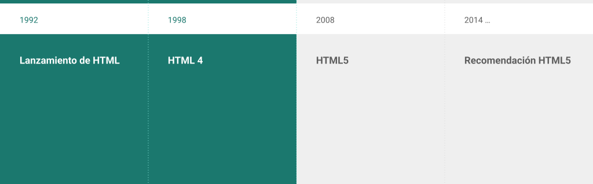
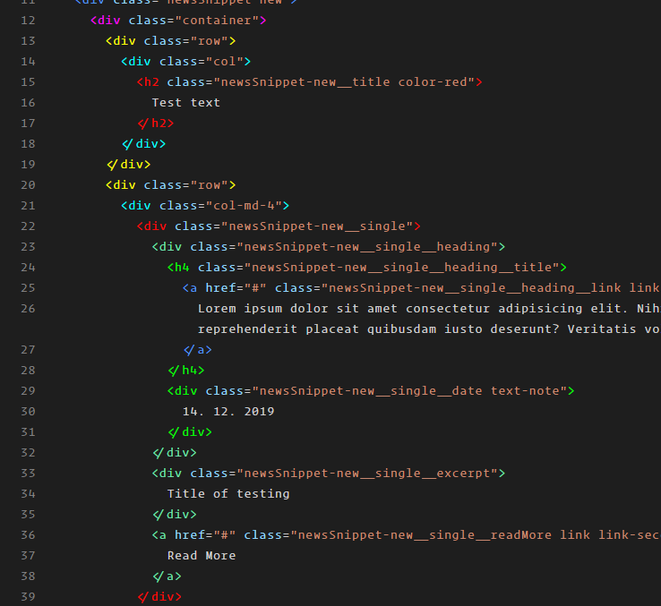
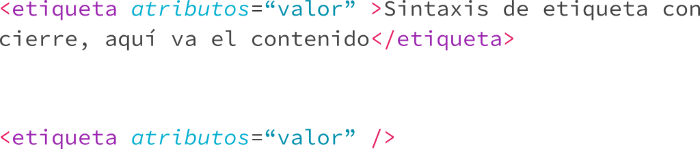
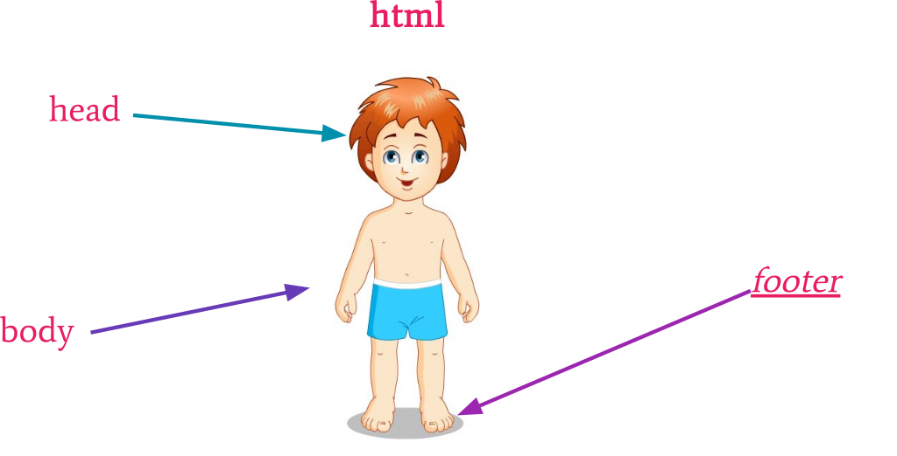
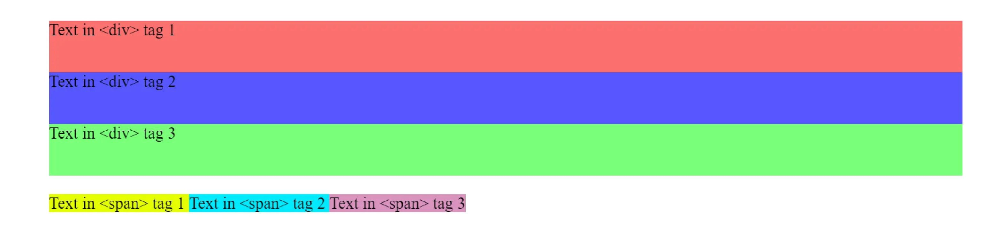

# HTML5

## Qué es HTML?

- Lenguaje de Marcado o Etiquetado
- Estructurado
- Semántico

## HyperText Markup Language (H T M L)


> **HTML *NO* es un lenguaje de programación**

### ¿Qué es un lenguaje de marcado?

Le dice al navegador la estructura de los elementos, su jerarquía  y organización en el documento.

### Evolución de HTML



## Navegadores


[StatCounter Global Stats - Browser Market Share](https://gs.statcounter.com/browser-market-share#monthly-202408-202507-bar)

## Estándares

|[W3C](https://www.w3.org/standards/)|[WHATWG](https://html.spec.whatwg.org/)|
|-|-|
|||

## Editores de Código

|Nombre|Img|
|-|-|
|[Visual Studio Code](https://code.visualstudio.com/)||
|[Sublime text](https://www.sublimetext.com/)||

### Extensiones de VS Code

|Nombre|Img|
|-|-|
|[Live Server](https://marketplace.visualstudio.com/items?itemName=ritwickdey.LiveServer)||
|[Indent-rainbow](https://marketplace.visualstudio.com/items?itemName=oderwat.indent-rainbow)||
|[Rainbow Brackets](https://marketplace.visualstudio.com/items?itemName=2gua.rainbow-brackets)||
|[Rainbow Tags](https://marketplace.visualstudio.com/items?itemName=voldemortensen.rainbow-tags)||

## Ventajas de HTML5

- Semántico
- Performance e integración
- Conectividad
- Acceso de dispositivos
- Offline y Almacenamiento
- Estilos
- Multimedia
- 3D y Efectos

### La última evolución de html

- **Semantics:**  allowing you to describe more precisely what your content is.
- **Connectivity:**  allowing you to communicate with the server in new and innovative ways.
- **Offline and storage:**  allowing webpages to store data on the client\-side locally and operate offline more efficiently.
- **Multimedia:**  making video and audio first\-class citizens in the Open Web.
- **2D/3D graphics  and effects:**  allowing a much more diverse range of presentation options.
- **Performance and integration:**  providing greater speed optimization and better usage of computer hardware.
- **Device access:**  allowing for the usage of various input and output devices.
- **Styling:**  letting authors write more sophisticated themes.

<https://developer.mozilla.org/en-US/docs/Web/Guide/HTML/HTML5>

## Estructura de una etiqueta HTML (Sintaxis)



## Con cierre


## Creando primer primer documento


## Estructura de Documento HTML




## Tipos de etiquetas

- Metadatos
- Sección
- Contenido de texto
- Texto semántico en línea
- Imagen y multimedia
- Contenido embebido
- Scripts
- Tablas
- Formulario
- Interactividad
- Web components

[https://developer.mozilla.org/en\-US/docs/web/html/Elemen](https://developer.mozilla.org/en-US/docs/web/html/Element)

## Etiquetas


- [W3S](https://www.w3schools.com/TAGs/)
- [Mozilla](https://developer.mozilla.org/en-US/docs/web/html/Element)
- [Extra](https://websitesetup.org/wp-content/uploads/2014/09/html5-cheat-sheet.png)

### Etiquetas de sección

```html
<\!DOCTYPE*  > Define que es HTML5

<html>. . . </html> Contiene a todo el documento

<body>. . . </body> Cuerpo del documento

<article>. . . </article> Indica una sección

<aside>. . . </aside> Indica una sección

<section>. . . </section> Indica una sección

<nav>. . . </nav> Indica una barra de navegación

<main>. . . </main> Indica una sección principal

<h\{1..6\}>. . . </h\{1..6\}> : Títulos y subtítulos

<header>. . . </header> : Cabecera de sección

<footer>. . . </footer> : Pie de sección
```

### Estructura de un sitio


### Etiqueta nivel-texto

**Formato:**

```html
<em>. . . </em> <-> <i>. . . </i> : itálica o cursiva

<strong>. . . <strong> <-> <b>. . . <b>: negritas

<u>. . . </u> Subrayado (underline)

<br>: Enter

<hr>: Separador
```

### Párrafo

Esta etiqueta es de las más usadas, para la creación de párrafos.

```html
<p> . . . </p>
```

- [W3s](https://www.w3schools.com/tags/tag_p.asp)
- [Mozilla](https://developer.mozilla.org/en-US/docs/Web/HTML/Element/p)

### Enlaces - Hipervínculos

La etiqueta de enlace para vincular una sección del documento, abrir otro sitio, descargar elemento, etc.

Requiere un parámetro:

- `href`: Va la URL o dirección del elemento

```html
<a href="url"> . . . </a>
```

### Listas Con Orden y Sin orden

Hay dos tipos de listas, con **orden** y **sin orden**. Puede contener una lista otra lista dentro o llevar sus *items*.
Cualquiera de las dos tipos de lista lleva sus etiquetas hijos, que son sus *items*.

Etiqueta hijo

```html
    <li>item</li>
```

Estructura completa

```html
<ol type=“a”>
    <li>item</li>
</ol>

<ul>
    <li>item</li>
</ul>
```

- [w3s](https://www.w3schools.com/HTML/html_lists.asp)
- [mozilla](https://developer.mozilla.org/en-US/docs/Learn/CSS/Styling_text/Styling_lists)

### Imágenes embebidas

La etiqueta  ``  sirve para embeber una imagen en el documento.

Requiere 2 atributos:

- `src`: Ubicación de la imagen
- `alt`: Descripción de la imagen

```html

```

- [w3s](https://www.w3schools.com/TAgs/tag_img.asp)
- [mozilla](https://developer.mozilla.org/en-US/docs/Learn/HTML/Multimedia_and_embedding/Responsive_images)

#### Formatos de imágenes

Hay diversos formatos de imágenes, estos son los soportados por el navegador:

- jpg
- jpeg
- gif
- png
- **svg**
- webp

Recursos:

- [Google Developer](https://developers.google.com/web/fundamentals/design-and-ux/responsive/images)
- [Google developer](https://developers.google.com/speed/webp/)
- [Mozilla](https://developer.mozilla.org/en-US/docs/Web/HTML/Element/img)

#### Recursos para imágenes

- [http://lorempixel.com/](http://lorempixel.com/)
- [https://unsplash.com/](https://unsplash.com/)
- [https://www.pexels.com/](https://www.pexels.com/)
- [https://pixabay.com/](https://pixabay.com/)
- [https://www.pinterest.es/pin/345862446376094908/](https://www.pinterest.es/pin/345862446376094908/?lp=true)

### Elementos de bloque y de línea




### Atributos globales

### Atributos (id y class)

```html
<h1 id=“title”>Título principal del sitio</h1>
```

**El atributo *ID* debe ser único e irrepetible**; es decir, solo un elemento lo puede tener. No lleva espacios, puede ser separado con guión bajo (_) o guión medio(-).

```html
<p class=“paragraph section”>Contenido en un párrafo...</p>
```

**El atributo *CLASS* se puede repetir, puede contener varios.** No lleva espacios, puede ser separado con guión bajo (_) o guión medio(-).

### Atributos globales más importantes

```html
<h2 title=“subtítulo del sitio”>Mi página web</h2>

<html lang=“es”>...</html>

<p data-*=“value”>...</p>
```

- [Mozilla](https://developer.mozilla.org/en-US/docs/Web/HTML/Global_attributes)
- [w3c](https://www.w3schools.com/tags/ref_standardattributes.asp)

### Etiqueta `<head>`

Es un contenedor de  ***metadata***  y va entre la etiqueta  `<html>` y  `<body>`
Los metadatos son datos sobre el documento (página).

> Los metadatos no se muestran.

*Se define normalmente el título, la codificación, estilos, scripts, etc.*

- [W3s](https://www.w3schools.com/tags/tag_head.asp)
- [Mozilla](https://developer.mozilla.org/en-US/docs/Web/HTML/Element/head)

### Etiqueta `meta`

```html
<meta atributo=“valor”/>
```

Es una etiqueta que contiene metadatos; es decir, es información adicional que contiene el documento para que el navegador lo interprete mejor y sepa qué hacer con él.

```html
<meta charset=“utf-8”/>

<meta name=“author” content=“Alejandro Leyva”/>

<meta name=“description” content=“Es un sitio web...”/>
```

- [W3s](https://www.w3schools.com/tags/tag_meta.asp)
- [Mozilla](https://developer.mozilla.org/en-US/docs/Web/HTML/Element/meta)

### Etiqueta title

Todos los documentos html (páginas) deben contener su título el cual indica en dónde está el usuario, además que el texto que sale en la parte superior de la pestaña.

==Siempre debe ir==

```html
<title> Google <title>
```


- [W3s](https://www.w3schools.com/tags/tag_title.asp)
- [Mozilla](https://developer.mozilla.org/en-US/docs/Web/HTML/Element/title)

### Estilos en head enlazados

En  *head*  pueden ir los estilos de forma embebida o enlazada.
**Enlaza estilos externos.**

```html
<link rel=“stylesheet” href=“url” media=“print” type=“text/css” >:
```

*[Más información](https://developer.mozilla.org/en-US/docs/Web/HTML/Element/style)*

### Estilos embebidos

Los estilos embebidos se pueden colocar dentro de la etiqueta  **head**  o  **body**.

```html
<style>

    // Estilos aquí

</style>
```

### Etiqueta enlazar (`link`)

Queremos enlazar archivos o algún recurso externo que necesitamos en nuestro HTML, usamos la etiqueta `link`.

**Elementos externos:**

- Iconos
- Hojas de estilo
- Fuentes

```html
<link rel=“tipo de relación” type=“MIME Type” href=“url”> Ligar otros elementos.
```

**Ejemplos**

```html
<link href="/shared-assets/misc/link-element-example.css" rel="stylesheet" />

<link rel="icon" href="favicon.ico" />

<link rel="preload" href="myFont.woff2" as="font" type="font/woff2" crossorigin="anonymous" />
```

[Más información](https://developer.mozilla.org/en-US/docs/Web/HTML/Element/link)

### Etiqueta `script`

```html
<script src=“url”></script>

<script>
  // código javascript
</script>
```

**Ejemplos**

```html
<script src="javascript.js"></script>

<script async src="js/vendor/jquery.js"></script>

<script>
  alert("Hello World!");
</script>
```

[Más información](https://developer.mozilla.org/en-US/docs/Web/HTML/Reference/Elements/script)

### Atributo role ARIAS

Define con una palabra descriptiva, cuál es la función de la sección para personas discapacitadas.

```html
<nav role=“navigation”>
  <ul>
    <li>
      <a href=“#”>HOME</a>
      </li>
  </ul>
</nav>

```

### Rutas relativas y absolutas

**Absoluta**

```bash
/proyecto/blog/2018/...
```

**Relativas**

```python
/ -> Raíz del servidor (root) o del sitio principal

./ -> A partir de mi ubicación

[nada] -> A partir de mi ubicación
```

### Arquitectura de proyecto

|Elementos|Ejemplo|
|-|-|
| **css o styles**  -> Estilos <br> **img**  -> imágenes, fotos <br> **js**  o  **javascript** -> archivos javascript <br> **audio**  -> audios <br> assets -> todo el contenido multimedia <br> favicon -> todos los iconos del sitio|

## Single page vs Multi pages

### Hipervínculo

```html
  <a href=“#”>HOME</a>
```

- `target`  <span style="color:#333333">=</span>  *“\_black”*
- `download`  <span style="color:#333333">=</span>  *“archivo.extension”*
- `href`  <span style="color:#333333">=</span>  *“teléfono | correo”*

- `mailto:`: Enviar un correo de forma directa. `mailto:correo@dominio.org`
- `tel:`: Llamar con solo click. `tel:+491570156`

[https://developer.mozilla.org/en\-US/docs/Web/HTML/Element/a](https://developer.mozilla.org/en-US/docs/Web/HTML/Element/a)

### Single pages

- Usas el atributo `id` para desplazarte dentro del sitio.
- Todo el contenido de tu página se encuentra desplegado en un solo html.

### Multi pages

- El contenido se encuentra distribuido en diferentes páginas.
- Debe ser fluido y lógico en cuestión de navegación.
- Debes saber en dónde estás y cómo regresar.
- Ayuda más al SEO.

### Tablas

Es un elemento que sirve para representar una tabla de datos.

```html
<table></table>

<thead></thead> opcional

<tbody></tbody>

<tfoot></tfoot> opcional

<tr></tr> table row

<th></th> table header

<td></td> table data

```

- caption  *[Más información](https://developer.mozilla.org/en-US/docs/Web/HTML/Element/caption)*

Ejemplo de tabla

```html
<table border="1">
   <caption>Descripción de tabla</caption>
    <thead>
      <tr>
        <th>Columna 1</th>
        <th>Columna 2</th>
      </tr>
    </thead>
    <tbody>
      <tr>
        <td>Dato 1.1</td>
        <td>Dato 2.1</td>
      </tr>
     <tr>
        <td>Dato 1.2</td>
        <td>Dato 2.2</td>
      </tr>
    </tbody>
</table>

```


### Figure y figcaption

Representa contenido de sí mismo. Una descripción es opcional (figcaption). Todo es considerado una unidad.

```html
<figure>

  
 <figcaption>Descripción de la imagen</figcaption>

</figure>

```

### Símbolos y Caracteres html

Una entidad HTML es un conjunto de caracteres ("string") que comienza con un ampersand (`&`) y termina con un punto y coma (`;`) . Las entidades son utilizadas frecuentemente para imprimir en pantalla caracteres reservados (aquellos que serían interpretados como HTML por el navegador) o invisibles (cómo tabulaciones). También pueden usarse para representar caracteres que no existan en algunos teclados, por ejemplo caracterés con tilde o diéresis.


- [https://unicode\-table.com/es/html\-entities/](https://unicode-table.com/es/html-entities/)
- [https://www.mclibre.org/consultar/htmlcss/html/html\-unicode\-simbolos.html](https://www.mclibre.org/consultar/htmlcss/html/html-unicode-simbolos.html)*
- [https://www.w3schools.com/charsets/ref_utf_symbols.asp](https://www.w3schools.com/charsets/ref_utf_symbols.asp)
- [https://html.spec.whatwg.org/multipage/named-characters.html#named-character-references](https://html.spec.whatwg.org/multipage/named-characters.html#named-character-references)
- [https://www.mclibre.org/consultar/htmlcss/html/html-entidades-caracter.html](https://www.mclibre.org/consultar/htmlcss/html/html-entidades-caracter.html)

### Formularios

- Los formularios son ocupados para recabar información.
- Dentro de un formulario se colocan inputs que se envían al servidor con la información.

```html
<form method=“POST|GET” action=“url/enviar/datos”>
    <!-- Cuerpo del formulario -->
</form>
```

*[W3s](https://www.w3schools.com/tags/tag_form.asp)*

*[Mozilla](https://developer.mozilla.org/en-US/docs/Web/HTML/Element/form)*

#### Elemento input

Los  **inputs**  necesitan su  **tipo** , información adicional para los datos se coloca el  **id**  y  **nombre** .

```html
<input type=“tipo de input” id=“id” name=“nombre”>
```

*[W3s](https://www.w3schools.com/tags/tag_input.asp)*

*[Mozilla](https://developer.mozilla.org/en-US/docs/Web/HTML/Element/Input)*

#### Entradas para formularios

- Text
- Submit
- Checkbox
- Radio
- Password
- Email
- Search
- Url
- Tel (teléfono)
- Number
- Range
- Date
- Week
- Month
- Time
- Datetime
- Color
- File

#### Atributos input

Estos atributos no siempre aplican a todo tipo de  *input* . Algunos atributos muy comunes son:

- *autocomplete*  = “ **on**  | off”
- *placeholder* = “texto que ve el usuario”

> Con el hecho de tener el atributo, se activa

- *disabled*
- *required*
- *autofocus*
- *checked*

#### Label (Etiquetas) & Area de Texto (textarea)

```html
<label for=“id_element”>Etiqueta</label>

<textarea id=“id” name=“nombre” rows=“numero” cols=“num”></textarea>
```

<label for=“id_element”>Etiqueta</label>

<textarea id=“id” name=“nombre” rows=“numero” cols=“num”></textarea>

- [Label](https://developer.mozilla.org/en-US/docs/Web/HTML/Element/label)
- [textarea](https://developer.mozilla.org/en-US/docs/Web/HTML/Element/textarea)

#### Barras de progreso

Cuando queremos colocar una barra de progreso podemos usar, se recomienda más usar un  *input*  tipo rango ( *range* ).

```html
<input type=“range” min=“0” max=“100” step=“1” value=“50”>

<meter value=“valor_actual” min=“0” max=“100”>...</meter>

<progress value=“valor” max=“100”>...</progress>
```

<input type=“range” min=“0” max=“100” step=“1” value=“50”>

<meter value=“valor_actual” min=“0” max=“100”>...</meter>

<progress value=“valor” max=“100”>...</progress>

#### Listas en formularios

Cuando queremos listas tenemos dos opciones, para ambos aplica la etiqueta  *option*  para agregar los valores de la lista, se combinan con un  *input*  por medio su atributo  *list*  y el  *id*  de la lista:

```html
<datalist id=“id”>...</datalist>

<select id=“id”>...</select>

<optgroup label=“etiqueta”>...</optgroup>

<option value=“valor”>
```

- [datalist](https://developer.mozilla.org/en-US/docs/Web/HTML/Element/datalist)
- [select](https://developer.mozilla.org/en-US/docs/Web/HTML/Element/select)
- [optgroup](https://developer.mozilla.org/en-US/docs/Web/HTML/Element/optgroup)
- [option](https://developer.mozilla.org/en-US/docs/Web/HTML/Element/option)

### Elementos externos

Agregando cosas externas de otro sitio:

- Otro sitio web
- Video de youtube
- Video de vimeo
- Chats (botón flotante)
- Formularios de google
- Mapas (Maps)
- Formularios externos
- Pdf

#### Fragmentos externos

```html
<ifragment src=“url” width=“ancho” height=“alto”>...</ifragment>

<embed src=“url” width=“ancho” height=“alto” type=“MIME Type”>

<object src=“url” width=“ancho” height=“alto” type=“MIME Type”>...</object>
```

- [iframe](https://developer.mozilla.org/en-US/docs/Web/HTML/Element/iframe)
- [embed](https://developer.mozilla.org/en-US/docs/Web/HTML/Element/embed)
- [object](https://developer.mozilla.org/en-US/docs/Web/HTML/Element/object)

#### Media

Contamos con etiquetas específicas para audio y video, teniendo mayor control sobre ellos.

```html
<video controls src=“url” width=“ancho”>...</video>

<audio src=“url” autoplay loop>...</audio>
```

- [video](https://developer.mozilla.org/en-US/docs/Web/HTML/Element/video)
- [audio](https://developer.mozilla.org/en-US/docs/Web/HTML/Element/audio)

### favicon

Todo sitio tiene un icono que lo identifica.

```html
<link rel=“icon” href=“url/favicon.ico” type=“image/x-icon” size=“16x16”>
```

- [W3s](https://www.w3schools.com/tags/att_link_sizes.asp)
- [Mozilla](https://developer.mozilla.org/en-US/docs/Glossary/Favicon)

### Herramientas para generar favicon

- [https://www.favicon-generator.org/](https://www.favicon-generator.org/)
- [https://realfavicongenerator.net/](https://realfavicongenerator.net/)
- [https://favicon.io/](https://favicon.io/)

### Optimización de imágenes (Locales vs Remotas)


[https://tinypng.com/](https://tinypng.com/)

## SEO (Search Engine Optimization)

Cuando creaste tu sitio web, es probable que lo hayas hecho teniendo en cuenta a tus usuarios, con el objetivo de facilitarles la búsqueda y exploración de tu contenido. Uno de esos usuarios es un motor de búsqueda, que ayuda a otras personas a descubrir tu contenido. ==El SEO (optimización para motores de búsqueda) consiste en ayudar a los motores de búsqueda a comprender tu contenido y a que los usuarios encuentren tu sitio y decidan si deben visitarlo a través de un motor de búsqueda==.

- Usa URLs descriptivas
- Agrupa las páginas de temas similares en directorios
  - <https://www.example.com/policies/return-policy.html>
  - <https://www.example.com/promotions/new-promos.html>
- Agrega imágenes a tu sitio y optimízarlas
- Agrega un texto alternativo descriptivo a la imagen
- Optimiza tus videos
- Usar Search Console

### Metadatos Sociales

- [Opengraph](https://ogp.me/)
- [Twitter Card](https://developer.twitter.com/en/docs/twitter-for-websites/cards/guides/getting-started)

### Datos Estructurados ([Microdatos](https://en.wikipedia.org/wiki/Microdata_(HTML)))

- [Schema.org](https://schema.org/)

### Testing del sitio web

- [https://developers.google.com/speed/](https://developers.google.com/speed/)
- [https://website.grader.com](https://website.grader.com/)
- [https://validator.w3.org/](https://validator.w3.org/)

### Complemento SEO

- [robot.txt](https://developers.google.com/search/docs/advanced/robots/intro)
- [human.txt](http://humanstxt.org/)
- [sitemap.xml](https://developers.google.com/search/docs/advanced/sitemaps/overview)

### Buenas prácticas de Google

[https://google.github.io/styleguide/htmlcssguide.html](https://google.github.io/styleguide/htmlcssguide.html)

## Resumen

- Head
  - Descripción del sitio
  - Sitemap.xml
  - Robot.txt
  - Humans.txt
  - favicon
  - Un título corto y fácil de recordar
  - Openghrap
  - Twitter card
  - Google analytics
- Body
  - Menú de navegación (Home, etc)
  - Jerarquía principal definida(header, main, footer)
  - Jerarquía por zona definida
  - Metadatos (Schema.org)
  - Footer

## Template Languages

[Pugjs](https://pugjs.org/api/getting-started.html)
[Nunjucks](https://mozilla.github.io/nunjucks/)
[Liquid](https://liquidjs.com/)
[Handlebars](https://handlebarsjs.com/)
[Mustache](https://mustache.github.io/)
[EJS](https://ejs.co/)
[HAML](https://haml.info/)
[Markdown](https://www.markdownguide.org/)
[MDX](https://mdxjs.com/)

### HTML vs Pug


### HTML vs Nunjucks

